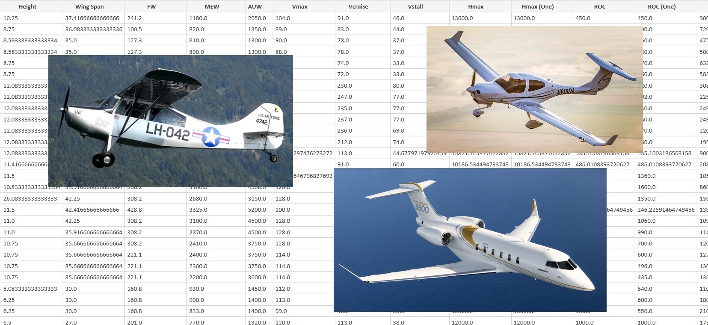
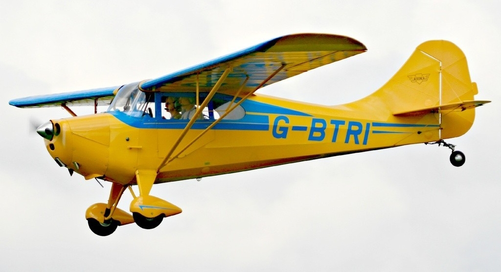
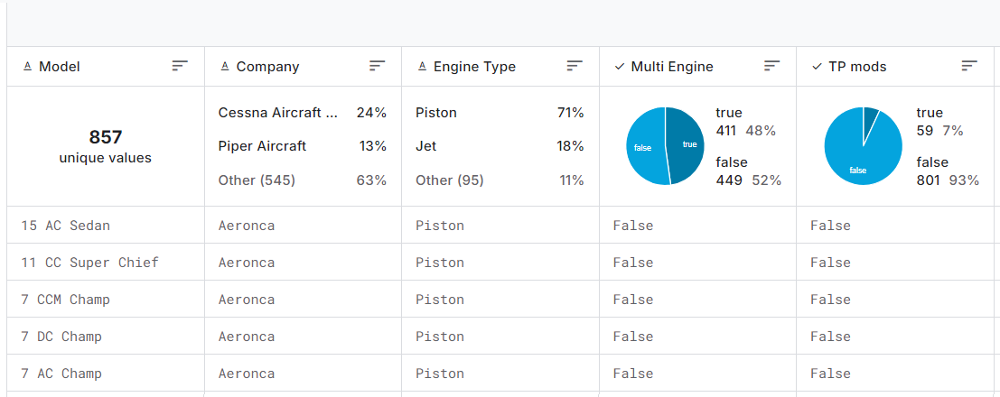
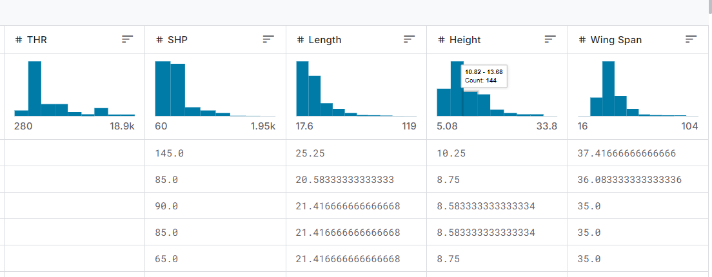
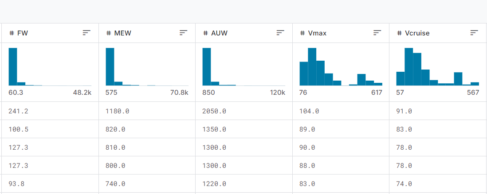
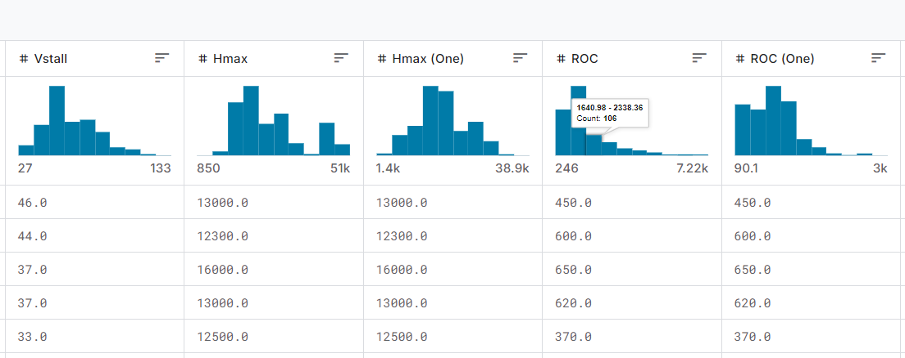
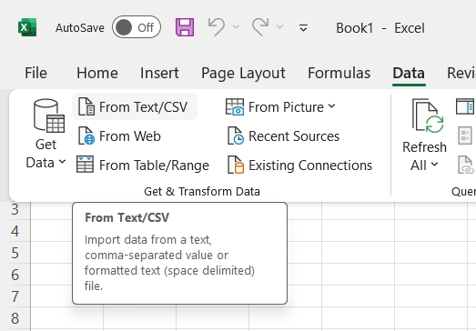
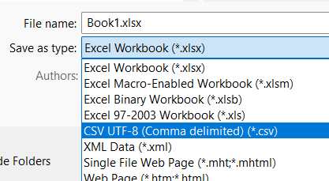

<br>

# Airplane Performance Analysis and Predictor tool



<div style="text-align: right;">
&nbsp;&nbsp;&nbsp;&nbsp;&nbsp;&nbsp;&nbsp;&nbsp;&nbsp;&nbsp;&nbsp;&nbsp;&nbsp;&nbsp;&nbsp;&nbsp;&nbsp;&nbsp;&nbsp;&nbsp;&nbsp;&nbsp;&nbsp;&nbsp;&nbsp;&nbsp;&nbsp;&nbsp;&nbsp;&nbsp;&nbsp;&nbsp;&nbsp;&nbsp;&nbsp;&nbsp;&nbsp;&nbsp;&nbsp;&nbsp;&nbsp;&nbsp;&nbsp;&nbsp;&nbsp;&nbsp;&nbsp;&nbsp;&nbsp;&nbsp;
</div>


[Airplane Performance Predictor](https://airplane-performance-predictor-852b7eac4d10.herokuapp.com/) is a Machine-learning (ML) project using a dataset with Airplanes Design and Performance parameters with the goal to achieve two things:
   - Visualize and Analyze the data general to gain insight that can help in the Conceptual Design Process of new airplanes.
   - Create a predictor tool by fitting ML pipelines that can predict (Regression) and categorize (Classification) values necessary for reaching specific Performance targets as well as to look for hidden patterns (clustering) in the data.

<br>
<br>

## Table of Contents

- [Dataset Content](#dataset-content)
- [Project terms & Jargon](#project-terms-and-jargon)
- [Business Requirements](#business-requirements)
- [Hypothesis](#hypothesis-and-how-to-validate)
- [Mapping Business Requirements to Data Visualisation and ML Tasks](#the-rationale-to-map-the-business-requirements-to-the-data-visualizations-and-ml-tasks)
- [ML Business Case](#ml-business-case)
- [Epics and User Stories](#epics-and-user-stories)
- [Dashboard Design](#dashboard-design)
- [Outlook](#outlook)
- [Technologies Used](#technologies-used)
- [Working with CSV-files in excel](#working-with-csv-files-in-excel)
- [Testing](#testing)
- [Unfixed Bugs](#unfixed-bugs)
- [Deployment](#deployment)
- [Forking and Cloning](#forking-and-cloning)
- [Credits](#credits)
- [Acknowledgements](#acknowledgements)
- [APPENDIX](#appendix)


## Dataset Content 

This tabulated dataset, [Aircraft Performance (Aircraft Bluebook) ](https://www.kaggle.com/datasets/heitornunes/aircraft-performance-dataset-aircraft-bluebook?select=Airplane_Complete_Imputation.csv), containing 860 General aviation and smaller airliners and buisness jets is sourced from Kaggle. Each row represents an airplane and each column contains an airplane attribute. 


- The dataset includes information about:
	- Airplane Meta data such as make and model
	- Airplane Design Attributes/Paramaters such as Engine type and Wingspan
	- Airplane Performance Attributes/parameters such as the Airplane's gross weight, Vcruise, service ceiling, rate of climb and range

The 1st and 2nd columns are meta data, the 3th to 13th are Design attributes and the 14th to 25th are Performance attributes

<br>

<div style="display: flex; justify-content: space-around;">
  &nbsp;&nbsp;&nbsp;&nbsp;&nbsp;
  &nbsp;&nbsp;&nbsp;&nbsp;&nbsp;
  
</div>

<figcaption style="color: grey;">
    Aeronca L-16 (left) representing the "lower" end of the data set and the Bombardier Global-7500 (right) representing the "upper" end and the most "middle"-value (mean) represented by "TBM 850 EADS_Socata Aircraft" (middle)
</figcaption>

<br>

**Important disclaimer**: This dataset is not owned by me, nor the person (Heitor Nunes) who posted the dataset on Kaggle. It is under the license of Informa Markets and can be accessed here: https://aircraftbluebook.com/Tools/ABB/ShowSpecifications.do

Note also that I have used an already partly cleaned and imputed file which means that some of the data entries might be an approximation using some common type of interpolation method or similar. The information, on the dataset site on Kaggle, in regards to units are ambigous often giving to units. In the table below the units I presume are correct are underlined.

| Variable/Attribute         | Meaning/Information/Quantity                                                     | Units                                                                                |
|------------------|-------------------------------------------------------------|--------------------------------------------------------------------------------------|
| Model       | **Airplane's name**                                     | n/a                  |
| Company           | **Manufacturer's name**                                             | n/a                                                                       |
| Engine Type    | **Engine type**                        | categorical: piston, propjet or jet\*    
| Multi Engine    | **Single or multiple engines**\**                         | categorical: single or multi engine                                                    |
| TP mods          | Refers most likely to **Thrust Performance modifications**                               | True or False 
| THR          | **Thrust** for ISA (International Standard Atmosphere)                               | lbf                                                                            |
| SHP          | **Shaft Horse Power** for  ISA (International Standard Atmosphere)                               | HP   
| Length          | **Airplane's length**                               | <u>ft</u> and in   
| Height          | **Airplane's height**                           | <u>ft</u> and in   
| Wing Span          | **Airplane's wingspan**                              | <u>ft</u> and in   
| FW      | **fuel capacity/weight**                           | gal or <u>lb</u>                                                                            |
| MEW           | **Empty weight** (a.k.a Manufacturer's Empty Weight )   | lb                                                                              |
| AUW     | **Gross weight** (a.k.a All-Up Weight)                         | lb                                                                            |
| Vmax    | **Maximum speed**                          | <u>knot</u> or Mach                                                            |
| Vcruise  | **High cruise speed** (Rcmnd cruise)                   | knot                                                                 |
| Vstall   | **Stall speed** on "dirty" configuration (flaps out, gear down, etc.)                         | knot                                                         |
| Hmax     | **Maximum density-altitude** with all engines working                           | ft (as density-altitude)                                                         |
| Hmax (One) | **Maximum density-altitude** with only one engine working.                       | ft (as density-altitude)                                                         |
| ROC     | **Rate Of Climb** with all engines working                           | ft/min                                                         |
| ROC (One)      | **Rate Of Climb** with only one engine working                            | ft/min                                                         |
| Vlo  | **Climb speed** during normal take-off for a 50 ft obstacle                        | ft/min                                                         |
| Slo         | **Takeoff ground run**                               | ft                                                   |
| Vl | **Landing speed** during normal landing for a 50 ft obstacle                       | ft/min                                                                              |
| Sl    | **Landing ground run**                                   | ft |
| Range   | **Range** The distance the airplane can fly without refueling | N.m. (Nautical miles)                                                            

\* Propjet is more commonly referred to as "turboprop"
\*\* Multiple Engines is most likely refering to no more than two (twin) engines.

Note that we can glean valuable insight on how the features are distributed already when retrieving the data on the Kaggle website







## Project Terms and Jargon 
    - "General Aviation" is civil aviation other than large-scale passenger or freight operations.
    - A "Categorical value" is a value that falls into distinct categories or groups. For example, the Engine Type can be classified as piston, propjet, or jet.
    - A "Continuous numeric value" is a value that can take any real number (whole numbers and decimals). For example, the Cruise Speed can be 237,5 knots.


## Business Requirements 
The ficticous company *Data Driven Design* (DDD) consist of data practitioners with the combined skillset of Vehicle Design and Machine Learning.


<br>

**Business Requirement 1** - The client is interested in having the data set concretized to the reality of actual airplanes in terms of bounds and mean etc. as well as understanding the relationships between the Design and Performance features in general and which of these relationships are having the greatest influence on each other.  
[Epics and User Stories](#epics-and-user-stories) A1, A2, B1, B2, B3, C3, C6, D1, D2, D3 and E1

**Business Requirement 2** - The client wants to test the premise that airplanes with Multiple Engines are “Higher, Further, Faster”.  
[Epics and User Stories](#epics-and-user-stories) A1, A2, B1, B2, B3, B4, B5, C1, C2, C3, C4, C5, C6, D1, D2, D4, D5, D6 and E1

**Business Requirement 3** - The client is interested in evaluating the “strength and weakness”-profile for two of their main competitors Piper and Cessna by evaluate the differences in performance for different features.  
[Epics and User Stories](#epics-and-user-stories) A1, A2, B1, B2, B3, C3, D1, D2, D3, and E1

**Business Requirement 4** - The client is interested in predicting the necessary values that an airplane Wing Span (Design feature) need to take on in order to reach certain performance targets.  
[Epics and User Stories](#epics-and-user-stories) A1, A2, B1, B2, B3, B4, B5, C1, C2, C3, C4, C5, C6, D1, D2, D3, D4, D5, D6, and E1

**Business Requirement 5** - The client is interested to see if any “invisible” yet distinct airplane clusters (based on features) are hiding in the data using unsupervised learning.  
[Epics and User Stories](#epics-and-user-stories) A1, A2, B1, B2, B3, B4, B5, C1, C2, C3, C4, C5, C6, D1, D2, D4, D5, D6, and E1

**Business Requirement 6** - The client (who currently investigates a new design for a high altitude loiter airplane) is interested to establish if their assumption that the max altitude (ceiling) an airplane can fly at is heavily dependent on span, larger span, higher altitude.  
[Epics and User Stories](#epics-and-user-stories) A1, A2, B1, B2, B3, C3, D1, D2, D3, and E1

**Business Requirement 7** - The client wishes to refine their design tools and validate the classic Breguet Range equation, which, among other things, says that the distance an airplane can fly is linearly dependent on a weight ratio that is getting larger when, the portion of the airplanes weight that is made up by fuel, is getting larger.  
[Epics and User Stories](#epics-and-user-stories) A1, A2, B1, B2, B3, C3, D1, D2, D3, and E1

**Bonus Study** - Although not requested by the client, Data Driven Design has decided to include a bonus study with the goal that the client should retain the service of DDD. The bonus study consist of pitching the two largest contributors to the data set, Cessna (24%) and Piper (13%) and see who fairs the best for different performance features. It is important to not draw too large conclusions from this superficial study since many more parameters would need to be taken into account for a fair study including aspects such as practicality, structural robustness and price just to mention a few. 

**Accuracy:** Naturally the goal is always to maximize accuracy however the nature of Conceptual design is that ballpark figures goes a long way as long as it is paired with a good sense of judgment and understanding of where the data comes from. Since the predictions are intended to be used only in the early Airplane Design Phase inaccuracies does not put human life at risk. The only thing at risk is money since a wrong decision here, i.e. to select a multi Engined instead of a single Engined configuration, can have disastrous consequences if a wrong decision in the early design stages needs to be redesigned in the later stages or alternatively design that fail to address the customer wishes and have a sub-optimal performance.

**Scalability:** The solution should be scalable in the sense that new features as well as new data points (Airplanes) could be added to the data set.

**Speed:** The model should be able to make predictions in real-time (more or less).

## Hypothesis and how to validate?
* Hypothesis 1:
    - We suspect Airplanes with Multiple Engines are “Higher, Further, Faster”
    - **Validation**: Build and train a model that correlates the features in the data set to the Multi Engine feature, evaluate accuracy and analyze and visualize the result with a parallel plot.

* Hypothesis 2 (BR1):
    - We propose that it is possible to create a simple regression function, based on historical airplane design and performance data, that can visualize the differences between the two manufacturers in different performance features along the range where both manufacturers are represented with airplanes.
    - **Validation**: Plot data points for the two manufacturers togethers with two  linear regression line representing each manufacturer and compare who comes out on top (literaly) for the different features and for different ranges in each feature.

* Hypothesis 3 (BR2):
    - We propose that it is possible to create a model, based on historical airplane design and performance data, that predicts the Wing Span of an airplane with a reasonable accuracy.
    - **Validation**: Build and train a regression model to predict the target variable Wing Span by the features in the data set, evaluate accuracy and create a user friendly interface where the user easily can predict Wing Spans by inputting desired airplane performance and design features.

* Hypothesis 4 (BR3):
    - We suspect that the data hides a few but not many distinct clusters of airplanes within the data set.
    - **Validation**: Build a cluster model using unsupervised learning to find potential clusters in the data set and analyze and visualize these clusters with graphs such as  

* Hypothesis 5 (BR4):
    - We suspect that airplanes with a larger wing span can reach a higher altitude, i.e. higher ceiling (Hmax).
    - **Validation**: Plot data points togethers with regression lines (without building/training a model) for different groups of the data that can be suspected to yield different characteristics and analyze the gradient of the regression lines.

* Hypothesis 6 (BR5):
    - We suspect that the linear relationship between the weight ratio in the Breguet range equations and the range might in a real world application not exhibit a non-linear.
    - **Validation**: Plot data points togethers with a linear and a non-linear regression line (without building/training a model) and compare how much the non-linear regression line deviates from the linear regression line.


## The rationale to map the business requirements to the Data Visualizations and ML tasks 
- **Business Requirement 1:** Data Visualization and Correlation study
	- We will inspect the data related to the customer base.
	- We will conduct a correlation study (Pearson and Spearman) to understand better how the variables are correlated to Churn.
	- We will plot the main variables against Churn to visualize insights.

- **Business Requirement 2:** Classification, Regression, Cluster and Data Analysis
	- We want to predict if a prospect will churn or not. We want to build a binary classifier.
	- We want to predict the tenure level for a prospect that is expected to churn. We want to build a regression model or change the ML task to classification depending on the regressor performance.
	- We want to cluster similar customers to predict from which cluster a prospect will belong.
	- We want to understand a cluster profile to present potential options to maintain or bring the prospect to a non-churnable cluster.


## ML Business Case 

### Predict Multi Engine
#### Classification Model
- We want an ML model to predict if an Airplane have a Multi Engine or single Engine on historical General Aviation Airplane data. The target variable is categorical and contains 2-classes. We consider a **classification model**. It is a supervised model, a 2-class, single-label, classification model output: 0 (no Multi Engine), 1 (yes Multi Engine).
- Our ideal outcome is to provide our client with a predictor tool that can assist in feasibility studies of new proposal.
- The model success metrics are
	- at least 80%"""""""""""""""""""" Recall for Multi Engine, on train and test set 
	- The ML model is considered a failure if:
		- !!!!!!!!!!!!!!!!
		- Precision for no Multi Engine is lower than 80% on train and test set. (We don't want wrong decisions on configuration, such as Single or Multi Engine to be passed on to the Preliminary design phase potentially resulting in extremely costly redesigns if the misstake  isn ot discovered until the Preliminary Design phase or, even worse, in the Detailed Design phase)
- The model output is defined as a flag, indicating if an Airplane have Multi or Single Engines.
- Heuristics: Currently, there are many predictor tools similar to this however most are in-house (and therefore not accessible) and our client want to develope a solid base of in-house tools to predict Design parameters such as if an airplane is more suited to have Single or Multi Engines.
- The training data to fit the model comes from the Kaggle data set.
	- Train data - features: all variables, but: Model, Company, THR, SHP.

### Predict Wing Span
#### Regression Model
- We want an ML model to predict Wing Span, ft. The target variable is numerical continous. We consider a **regression model**, which is supervised and multidimensional.
- Our ideal outcome is to provide our client with a predictor tool that can assist in feasibility studies of new proposal.
- The model success metrics are
	- At least 0.7!!!!!!!????????? for R2 score, on train and test set
	- The ML model is considered a failure if:
		- !!!!!!!!!!!!!!!!
- The output is defined as a continuous value for Wing Span in ft.
- Heuristics: Currently, there are many such predictor tools but most are in-house (and therefore not accessible) and our client want to develope a solid base of in-house tools to predict Design parameters such as Wing Span for different customer specifications.
- The training data to fit the model comes from the Kaggle data set.
    - Train data - Target: Wing Span; features: all other variables, but Model, Company, THR, SHP, Engine_Type, Multi_Engine, TP_mods, Hmax_(One), ROC_(One)


### Cluster Analysis
#### Clustering Model
- We want an ML model to cluster airplanes with similare Performance or Design characteristics. It is an unsupervised model.
- Our ideal outcome is to provide our client with reliable insight into a key differences between airplanes and what these differences consist of in terms of Design and Performance Parameters and how these are linked.
- The model success metrics are
	- at least 0.45!!!!!!!!!!!!!!!!!! for the average silhouette score
	- The ML model is considered a failure if the model suggests either to many clusters (>10) or to few clusters (<3) unless these clusters are really distinct and are not trivial considering the data, e.g. belong to a single categorical value that would alter many other features in an equal amount, e.g. TP mods which is a performance enhancing modification to the Engine.
- The output is defined as an additional column appended to the dataset. This column represents the cluster's suggestions. It is a categorical and nominal variable represented by numbers starting at 0.
- Heuristics: Clustering or aircraft data has been done before on other data however our client wishes to have their own tool on their own data.
- The training data to fit the model comes from the Kaggle data set.
	- Train data - features: all variables, but Model', 'Company', 'Multi_Engine', 'THR', 'SHP', 'Hmax_(One)', and 'ROC_(One)'

## Epics and User Stories
* The project was split into five Epics and within each of these, User Stories according to the agile methodology.

### Epic - Information Gathering and Data Collection
* **User Story A1** - As a data scientist, I can import/upload the dataset from Kaggle to my workspace.
* **User Story A2** - As a data scientist, I can load a saved dataset so that I can inspect, analyze, threat and modify the data for viusalization and ML tasks.

### Epic - Data Visualization, Cleaning, and Preparation
* **User Story B1** - As a data scientist, I can visualize the dataset with graphs and images so that I can interpret and test hypothesis.
* **User Story B2** - As a data scientist, I can evaluate the dataset to determine what data cleaning tasks need to be carried out.
* **User Story B3** - As a data scientist, I can impute or drop missing data to prepare the dataset for a ML model.
* **User Story B4** - As a data scientist, I can determine whether the target requires balancing in order to ensure the ML is not fed imbalanced data.
* **User Story B5** - As a data scientist, I can carry out feature engineering to best transform the data for the ML model.

### Epic - Model Training, Optimization and Validation
* **User Story C1** - As a data scientist, I can split the data into a train and test set to prepare it for the ML model.
* **User Story C2** - As a data scientist, I can fit a ML pipeline with all the data to prepare the ML model for deployment.
* **User Story C3** - As a data scientist, I can determine the best algorithms for the ML models to test the hypothesis's.
* **User Story C4** - As a data scientist, I can carry out an extensive hyperparameter optimization to ensure the ML model gives the best results
* **User Story C5** - As a data scientist, I can determine the best features from the ML pipeline to determine whether the it can be optimized further.
* **User Story C6** - As a data scientist, I can evaluate the ML model's performance to determine whether it can successfully test the Hypothesis.

### Epic - Dashboard Planning, Designing, and Development
* **User Story D1** - As a domain specific user, I can view a project summary that describes the project, dataset and business requirements to understand the project at a glance.
* **User Story D2** - As a domain specific user, I can view the project hypotheses and validations to determine what the project was trying to achieve and whether it was successful.
* **User Story D3** - As a domain specific user, I can enter unseen data into the model and receive a prediction.
* **User Story D4** - As an data scientist, I can view the analysis to see how the outcomes were arrived at.
* **User Story D5** - As an data scientist, I can view all the data to understand the model performance and see statistics related to the model.
* **User Story D6** - As a domain specific user, I can view the project conclusions to see if the model was successful and if the business requirements met.

### Epic - Dashboard Deployment and Release
* **User Story E1** - As a domain specific user, I can view the project dashboard on a live deployed website.
* **User Story E2** - As a data scientist user, I can follow instructions in the readme to fork the repository and deploy the project for myself.

## Dashboard Design

### Page 1: Quick project Summary
- Quick project summary
	- Project Terms & Jargon
	- Describe Project Dataset
	- State Business Requirements

### Page 2: Airplane Feature Explanation
- Explanation of the abbreviated features for the features.

### Page 3: Get to know the dataset
- Concretize the data set for by display images of the airplanes in the "middle" and "Edges" of the data set:
	- Image: One image of each airplane that falls into the minimum, mean and maximum value for each feature (except for the categorical values).

### Page 4: Multi Engine Airplane Study
- State business requirement 2
- Set of widgets inputs, which relates to the prospect profile. Each set of inputs is related to a given ML task to predict prospect Churn, Tenure and Cluster.
- "Run predictive analysis" button that serves the prospect data to our ML pipelines and predicts if the prospect will churn or not, if so, when. It also shows to which cluster the prospect belongs and the cluster's profile. For the churn and tenure predictions, the page will inform the associated probability for churning and tenure level.

### Page 5: Wing Span Predictor
- Considerations and conclusions after the pipeline is trained
- Present ML pipeline steps
- Feature importance
- Pipeline performance

### Page 6: Regression Playground
- State business requirement 2
- Set of widgets inputs, which relates to the prospect profile. Each set of inputs is related to a given ML task to predict prospect Churn, Tenure and Cluster.
- "Create Regression Plot" button to generate a regression plot according to the selections given in the drop down menus: 
  - Dependent feature, e.g Wing_Span
  - Independent feature 1, e.g. Hmax
  - Independent feature 2, e.g. AUW
  - Filter Option - All Airplanes or Piper vs. Cessna
  - Regression Type: Linear or Quadratic
  - Type of graph: 2D or 3D

### Page 7: Domain Specific Analysis
- State business requirement 2
- Set of widgets inputs, which relates to the prospect profile. Each set of inputs is related to a given ML task to predict prospect Churn, Tenure and Cluster.
- "Run predictive analysis" button that serves the prospect data to our ML pipelines and predicts if the prospect will churn or not, if so, when. It also shows to which cluster the prospect belongs and the cluster's profile. For the churn and tenure predictions, the page will inform the associated probability for churning and tenure level.

### Page 8: Project Hypothesis and Validation
- Before the analysis, we knew we wanted this page to describe each project hypothesis, the conclusions, and how we validated each. After the data analysis, we can report that:
- 1 - We suspect customers are churning with low tenure levels
	- Correct. The correlation study at Churned Customer Study supports that.
- 2 -  A customer survey showed our customers appreciate Fibre Optic.
	- A churned user typically has Fiber Optic, as demonstrated by a Churned Customer Study. The insight will be taken to the survey team for further discussions and investigations.

### Page 9: ML: Predict Wing Span
- Considerations and conclusions after the pipeline is trained
- Present ML pipeline steps
- Silhouette plot
- Clusters distribution across Churn levels
- Relative Percentage (%) of Churn in each cluster
- The most important features to define a cluster
- Cluster Profile

### Page 10: ML: Cluster Analysis
- Considerations and conclusions after the pipeline is trained
- Present ML pipeline steps
- Silhouette plot
- Clusters distribution across Churn levels
- Relative Percentage (%) of Churn in each cluster
- The most important features to define a cluster
- Cluster Profile


## Outlook 

### Dashboard
Add the categorical values (Multi Engine, Engine Type and TP_mods) to the menu in the Regression Playground.

### Impute more features to the data

The **'year of first flight'** is an easily retrievable feature that would be valuable for two reasons:
* It would allow predictive accuracy/feasibility to be increased since old airplanes could be filtered out when predicting a modern design. Note that the data points ranges from today all the way back to the 40ies and perhaps even earlier. 
* Having the year of first flight would enable a very interesting study of how Airplane performance and design have developed over the last ca 80 years!

Furthermore **Aircraft Structure** with categories "Wood and Fabric", "Metal and Fabric", "All-Metal", "Metal and Composites" and "All-Composites" would, like "year of first flight", add value in two ways:
* It would allow predictions to be based only on relevant types of airplanes. 
* It would allow an interesting assessment on the benefit of construction type/material on actual performance.

**Wing Area** Is one of the, for aircraft Design, most important and fundamental parameters, much more important than Wing Span that currently populates the data. Imputing Wing Area would also together with the existing data allow other important features to be calculated:
* Wing area together with wing span allow the following to be calculated:
  * **Mean chord** by dividing Wing Span with Wing Area (Which in turn allow the Wing Reynolds number to be calculated tother with a velocity of your choice from the data set and some constants
  * **Wing Aspect Ratio** by squaring Wing Area and divide by Wing Span
  The Wing Area is a relatively standard item in the specs of an airplane and is therefore also a relatively easily feature to retrieve.

## Technologies Used 

The technologies used throughout the development are listed below:

### Languages

* [Python](https://www.python.org/)

### Python Packages

* [plotly](https://plotly.com/) - Open-source graphing library for interactive visualizations.
* [yellowbrick](https://www.scikit-yb.org/en/latest/) - Open-source visualization library for ML.
* [Jinja2](https://jinja.palletsprojects.com/en/stable/) - Open-source templating engine for Python.
* [MarkupSafe](https://pypi.org/project/MarkupSafe/) - Open-source library for escaping strings in web applications..
* [protobuf](https://protobuf.dev/) - Language-neutral, platform-neutral extensible mechanisms for serializing structured data.
* [ipywidgets](https://ipywidgets.readthedocs.io/en/stable/) - Interactive browser controls for Jupyter notebooks.
* [altair](https://altair.com/machine-learning) - Open-source declarative visualization library for Python with interactive statistical graphics.
* [streamlit](https://streamlit.io/) - open-source framework for scientific interactive web apps.
* [Pandas](https://pandas.pydata.org/docs/index.html) - Open source library for data manipulation and analysis.
* [Numpy](https://numpy.org/doc/stable/index.html) - Adds support for large, multi-dimensional arrays and matrices, and high-level mathematical functions.
* [Matplotlib](https://matplotlib.org/) - Comprehensive library for creating static, animated and interactive visualisations.
* [Seaborn](https://seaborn.pydata.org/) - Another data visualisation library for drawing attractive and informative statistical graphics.
* [Feature-engine](https://feature-engine.trainindata.com/en/latest/) - Library with multiple transformers to engineer and select features for machine learning models.
* [scikit-learn](https://scikit-learn.org/stable/) - Open source machine learning library that features various algorithms for training a ML model.
* [SciPy](https://scipy.org/) - Library used for scientific computing and technical computing.
* [XGBoost](https://xgboost.readthedocs.io/en/stable/) - Optimised distributed gradient boosting library.
* [Imbalanced-learn](https://imbalanced-learn.org/stable/) - Provides tools for dealing with classification problems with imbalanced classes.
* [Joblib](https://joblib.readthedocs.io/en/stable/) - Provides tools for lightweight pipelining, e.g. caching output values.

### Other Technologies

* [Microsoft Excel](https://en.wikipedia.org/wiki/Microsoft_Excel) - For manual inspection and processing of data set
* [Git](https://git-scm.com/) - For version control
* [GitPod](https://www.gitpod.io/) - Cloudbased IDE used for development
* [GitHub](https://github.com/) - Code repository
* [Heroku](https://heroku.com) - For application deployment

## Working with CSV-files in Excel
Opening the data in Microsoft Excel can be a good idea, especially in the beginning of the project, if you want to view, scroll and access the data-set for inspection and test things out. If the data set is a comma separated file (csv) you can not open the file in the normal manner, instead you need to import the file to Excel:
1.Open excel and a new blank worksheet
2. click "From text/CSV"-icon in the "data"-tab in the "ribbon"-menu.
3. Follow the instructions.



<br>

Saving the csv-file in Excel is done the normal way however it is important to save it using the correct file-format: CSV UTF-8 (Comma delimited)(*.csv) and remember to give it a new file name unless you want to overwrite the original file.



## Testing 
### Manual Testing
Manual testing have been carried out of the Dashboard to ensure that the interface can handle all combinations of input.

### Validation
All code in the app_pages and src directories have been validated as conforming to PEP8 standards using [CodeInstitute's PEP8 Linter](https://pep8ci.herokuapp.com/). The only remaining errors are of the type: E501 line too long (86 > 79 characters) which I have not fixed.

### Automated Unit Tests
No automated unit tests have been carried out.


## Unfixed Bugs 
* In the Regression Playground the values on the color value bar sometimes sits on top of each other when the 'Filter Option' is set to: 'Piper vs. Cessna' at the same time as the 'Type of graph' is set to: '3D regression'. I have tried to solve this by creating two separate color value bars side by side, one for Piper and one for Cessna, however failed to make it work.
* The scale in the Parallel plot feels "Upside down" in the context of the features that it represents, i.e. zero velocity or zero altitude are at the top of the "vertical axis" and the maximum values at the bottom! This is not exactly a bug however it feels very unintuitive and is for this reason desirable to change.

## Deployment 
### Heroku

* The App live link is: [Airplane Performance Predictor](https://airplane-performance-predictor-852b7eac4d10.herokuapp.com/)

The project was deployed to Heroku using the following steps:

1. Within your working directory, ensure there is a setup.sh file containing the following:
```
mkdir -p ~/.streamlit/
echo "\
[server]\n\
headless = true\n\
port = $PORT\n\
enableCORS = false\n\
\n\
" > ~/.streamlit/config.toml
```

2. Within your working directory, ensure there is a runtime.txt file containing a [Heroku-20](https://devcenter.heroku.com/articles/python-support#supported-runtimes) stack supported version of Python.
```
python-3.10
```
3. Within your working directory, ensure there is a Procfile file containing the following:
```
web: sh setup.sh && streamlit run app.py
```
4. Ensure your requirements.txt file contains all the packages necessary to run the streamlit dashboard.
5. Update your .gitignore and .slugignore files with any files/directories that you do not want uploading to GitHub or are unnecessary for deployment.
6. Log in to [Heroku](https://id.heroku.com/login) or create an account if you do not already have one.
7. Click the **New** button on the dashboard and from the dropdown menu select "Create new app".
8. Enter a suitable app name and select your region, then click the **Create app** button.
9. Once the app has been created, navigate to the Deploy tab.
10. At the Deploy tab, in the Deployment method section select **GitHub**.
11. Enter your repository name and click **Search**. Once it is found, click **Connect**.
12. Navigate to the bottom of the Deploy page to the Manual deploy section and select main from the branch dropdown menu.
13. Click the **Deploy Branch** button to begin deployment.
14. The deployment process should happen smoothly if all deployment files are fully functional. Click the button **Open App** at the top of the page to access your App.
15. If the build fails, check the build log carefully to troubleshoot what went wrong.
16. Select Automatic deploys so that Heroku always uses your latest commited GitHub-version.

## Forking and Cloning 
If you wish to fork or clone this repository, please follow the instructions below:

### Forking
1. In the top right of the main repository page, click the **Fork** button.
2. Under **Owner**, select the desired owner from the dropdown menu.
3. **OPTIONAL:** Change the default name of the repository in order to distinguish it.
4. **OPTIONAL:** In the **Description** field, enter a description for the forked repository.
5. Ensure the 'Copy the main branch only' checkbox is selected.
6. Click the **Create fork** button.

### Cloning
1. On the main repository page, click the **Code** button.
2. Copy the HTTPS URL from the resulting dropdown menu.
3. In your IDE terminal, navigate to the directory you want the cloned repository to be created.
4. In your IDE terminal, type ```git clone``` and paste the copied URL.
5. Hit Enter to create the cloned repository.

### Installing Requirements
**WARNING:** The packages listed in the requirements.txt file are limited to those necessary for the deployment of the dashboard to Heroku, due to the limit on the slug size.

In order to ensure all the correct dependencies are installed in your local environment, run the following command in the terminal:

    pip install -r full-requirements.txt


## Credits 

### Content

The tutorial [k-means: The simplest (but most used) partitioning clustering method](https://www.youtube.com/watch?v=u1EUrxobvk8) was used to understand K-means and Sillhoouette-scoore.

I have looked at both the [Code Institute template](https://github.com/Code-Institute-Solutions/milestone-project-heritage-housing-issues) as well as the [CVD predictor](https://github.com/jfpaliga/CVD-predictor) for how to structure the readme.


#### Equations
- Equations was taken mainly from Anderson, John D. Aircraft Performance and Design. McGraw-Hill, 1999.

#### Exploratory Data Analysis Notebook
* Much of the functionality/methodology/code have been taken from the Code Institute "Churnometer" walkthrough project and adapted to this project. This code appears In particular in:
  - 03 - DataCleaning has been used for: 4_data_cleaning
  - 04 - FeatureEngineering has been used for: 5_feature_engineering
  - 05 - Modeling and Evaluation - Predict Churn has been used for: 6A_modeling_and_evaluation-predict_engine_type
  - (06 - Modeling and Evaluation - Predict Tenure has been used for: 7_modeling_and_evaluation_predict_wing_span)
  - 07 - Modeling and Evaluation - Cluster Sklearn has been used for: 8_modeling_and_evaluation_cluster_sklearn

### Media
- The Photos of Airplanes was taken from various Open-Source sites.

## Acknowledgements 
Thanks to my mentor Mo Shami, for support and friendly manners during the project.

## APPENDIX 
Please see the [APPENDIX](APPENDIX.md) for more domain specific information.