<br>

# General Aviation Performance Analysis and Predictor tool


<div style="text-align: right;">
&nbsp;&nbsp;&nbsp;&nbsp;&nbsp;&nbsp;&nbsp;&nbsp;&nbsp;&nbsp;&nbsp;&nbsp;&nbsp;&nbsp;&nbsp;&nbsp;&nbsp;&nbsp;&nbsp;&nbsp;&nbsp;&nbsp;&nbsp;&nbsp;&nbsp;&nbsp;&nbsp;&nbsp;&nbsp;&nbsp;&nbsp;&nbsp;&nbsp;&nbsp;&nbsp;&nbsp;&nbsp;&nbsp;&nbsp;&nbsp;&nbsp;&nbsp;&nbsp;&nbsp;&nbsp;&nbsp;&nbsp;&nbsp;&nbsp;&nbsp;
</div>

<br><br>
 
<br><br>
This is a A Predictive Model for General Aviation.

Exploration and Prediction of dependency between Design and Performance parameters and Determining Propulsion and Wing Span to meet Performance specificationss

SAD Predictor is a machine-learning (ML) project using a General Aviation Performance dataset to achieve two things:

1. determine whether a ML pipeline could be built to predict the values that Design parameters need to take on to reach Specified Performance target. This was achieved by using a classification task, using the Vmax, ROC and Range attribute from the dataset as the targets and the remaining attributes as features.

2. x

## Table of Contents

- [Dataset Content](## Dataset Content)
- [Project Terms & Jargon](## Project Terms & Jargon)
- [Hypothesis and how to validate?](## Hypothesis and how to validate?)
- [The rationale to map the business requirements to the Data Visualizations and ML tasks](## The rationale to map the business requirements to the Data Visualizations and ML tasks)
- [ML Business Case](## ML Business Case)
- [Predict Churn](### Predict Churn)
- [Classification Model](#### Classification Model)
- [Predict Tenure](### Predict Tenure)
- [Regression Model](#### Regression Model)
- [Classification Model](#### Classification Model)
- [Cluster Analysis](### Cluster Analysis)
- [Clustering Model](#### Clustering Model)
- [Dashboard Design (Streamlit App User Interface)](## Dashboard Design (Streamlit App User Interface))
- [Page 1: Quick project summary](### Page 1: Quick project summary)
- [Page 2: Customer Base Churn Study](### Page 2: Customer Base Churn Study)
- [Page 3: Prospect Churnometer](### Page 3: Prospect Churnometer)
- [Page 4: Project Hypothesis and Validation](### Page 4: Project Hypothesis and Validation)
- [Page 5: Predict Churn](### Page 5: Predict Churn)
- [Page 6: Predict Tenure](### Page 6: Predict Tenure)
- [Page 7: Cluster Analysis](### Page 7: Cluster Analysis)


## Table of Contents

- [Dataset Content](#dataset-content)
- [Project Terms & Jargon](#project-terms-&-jargon)
- [Hypothesis and how to validate?](#hypothesis-and-how-to-validate?)
- [The rationale to map the business requirements to the Data Visualizations and ML tasks](#the-rationale-to-map-the-business-requirements-to-the-data-visualizations-and-ml-tasks)
- [ML Business Case](#ml-business-case)
- [Predict Churn](###predict-churn)
- [Classification Model](####classification-model)
- [Predict Tenure](###predict-tenure)
- [Regression Model](####regression-model)
- [Classification Model](####classification-model)
- [Cluster Analysis](###cluster-analysis)
- [Clustering Model](####clustering-model)
- [Dashboard Design (Streamlit App User Interface)](##dashboard-design-(streamlit-app-user-interface))
- [Page 1: Quick project summary](###page-1:-quick-project-summary)
- [Page 2: Customer Base Churn Study](###page-2:-customer-base-churn-study)
- [Page 3: Prospect Churnometer](###page-3:-prospect-churnometer)
- [Page 4: Project Hypothesis and Validation](###page-4:-project-hypothesis-and-validation)
- [Page 5: Predict Churn](###page-5:-predict-churn)
- [Page 6: Predict Tenure](###page-6:-predict-tenure)
- [Page 7: Cluster Analysis](###page-7:-cluster-analysis)


## Table of Contents
- [Dataset Content](#section-1)
- [Project Terms & Jargon](#section-2)
- [Hypothesis and how to validate?](#section-3)
- [The rationale to map the business requirements to the Data Visualizations and ML tasks](#section-4)
- [ML Business Case](#section-5)
  - [Predict Churn](#subsection-51)
    - [Classification Model](#subsection-511)
  - [Predict Tenure](#subsection-52)
    - [Regression Model](#subsection-521)
    - [Classification Model](#subsection-522)
  - [Cluster Analysis](#subsection-53)
    - [Clustering Model](#subsection-531)
- [Dashboard Design (Streamlit App User Interface)](#section-6)
  - [Page 1: Quick project summary](#subsection-61)
  - [Page 2: Customer Base Churn Study](#subsection-62)
  - [Page 3: Prospect Churnometer](#subsection-63)
  - [Page 4: Project Hypothesis and Validation](#subsection-64)
  - [Page 5: Predict Churn](#subsection-65)
  - [Page 6: Predict Tenure](#subsection-66)
  - [Page 7: Cluster Analysis](#subsection-67)


# Title

## Section 1

### Subsection 1.1

## Section 2

### Subsection 2.1


## Dataset Content

This tabulated dataset, [Aircraft Performance (Aircraft Bluebook) ](https://www.kaggle.com/datasets/heitornunes/aircraft-performance-dataset-aircraft-bluebook?select=Airplane_Complete_Imputation.csv), containing 860 General aviation and smaller airliners and buisness jets is sourced from Kaggle. Each row represents an airplane and each column contains an airplane attribute. 


- The dataset includes information about:
	- Airplane Meta data such as make and model
	- Airplane Design Attributes/Paramaters such as Engine type and Wingspan
	- Airplane Performance Attributes/parameters such as the Airplane's gross weight, Vcruise, service ceiling, rate of climb and range

The 1st and 2nd columns are meta data, the 3th to 13th are Design attributes and the 14th to 25th are Performance attributes
<br>
<div style="display: flex; justify-content: space-around;">
  &nbsp;&nbsp;&nbsp;&nbsp;&nbsp;
  &nbsp;&nbsp;&nbsp;&nbsp;&nbsp;
  
</div>
<figcaption>Aeronca L-16 (left) representing one end of the data set and the Bombardier Global-7500 (right) representing the other and the most "middle"-value (mean) represented by "TBM 850 EADS_Socata Aircraft" (middle)</figcaption>

<br>

**Important disclaimer**: This dataset is not owned by me, nor the person (Heitor Nunes) who posted the dataset on Kaggle. It is under the license of Informa Markets and can be accessed here: https://aircraftbluebook.com/Tools/ABB/ShowSpecifications.do

Note also that I have used an already partly cleaned and imputed file which means that some of the data entries might be an approximation using some common type of interpolation method or similar.

| Variable/Attribute         | Meaning/Information/Quantity                                                     | Units                                                                                |
|------------------|-------------------------------------------------------------|--------------------------------------------------------------------------------------|
| Model       | **Airplane's name**                                     | n/a                  |
| Company           | **Manufacturer's name**                                             | n/a                                                                       |
| Engine Type    | **Engine type**                        | categorical: piston, propjet or jet\*    
| Multi Engine    | **Single or multiple engines**\**                         | categorical: single or multi engine                                                    |
| TP mods          | Refers most likely to **Thrust Performance modifications**                               | True or False 
| THR          | **Thrust** for ISA (International Standard Atmosphere)                               | lbf                                                                            |
| SHP          | **Shaft Horse Power** for  ISA (International Standard Atmosphere)                               | HP   
| Length          | **Airplane's length**                               | ft and in   
| Height          | **Airplane's height**                           | ft and in   
| Wing Span          | **Airplane's wingspan**                              | ft and in   
| FW      | **fuel capacity/weight**                           | gal or lb                                                                            |
| MEW           | **Empty weight** (a.k.a Manufacturer's Empty Weight )   | lb                                                                              |
| AUW     | **Gross weight** (a.k.a All-Up Weight)                         | lb                                                                            |
| Vmax    | **Maximum speed**                          | knot or Mach                                                            |
| Vcruise  | **High cruise speed** (Rcmnd cruise)                   | knot                                                                 |
| Vstall   | **Stall speed** on "dirty" configuration (flaps out, gear down, etc.)                         | knot                                                         |
| Hmax     | **Maximum density-altitude** with all engines working                           | ft (as density-altitude)                                                         |
| Hmax (One) | **Maximum density-altitude** with only one engine working.                       | ft (as density-altitude)                                                         |
| ROC     | **Rate Of Climb** with all engines working                           | ft/min                                                         |
| ROC (One)      | **Rate Of Climb** with only one engine working                            | ft/min                                                         |
| Vlo  | **Climb speed** during normal take-off for a 50 ft obstacle                        | ft/min                                                         |
| Slo         | **Takeoff ground run**                               | ft                                                   |
| Vl | **Landing speed** during normal landing for a 50 ft obstacle                       | ft/min                                                                              |
| Sl    | **Landing ground run**                                   | ft |
| Range   | **Range**                      | N.m. (Nautical miles)                                                            

\* Propjet is more commonly referred to as "turboprop"
\*\* Multiple Engines is most likely refering to no more than two (twin) engines.

Note that we can glean valuable insight on how the features are distributed already when retrieving the data on the Kaggle website


## Project Terms & Jargon
    - "General Aviation" is civil aviation other than large-scale passenger or freight operations.
    - A "Categorical value" is a value that falls into distinct categories or groups. For example, the Engine Type can be classified as piston, propjet, or jet.
    - A "Continuous numeric value" is a value that can take any real number (whole numbers and decimals). For example, the Cruise Speed can be 237,5 knots.


## Business Requirements
The ficticous company *Data Driven Design* (DDD) consist of data practitioners with the combined skillset of Vehicle Design and Machine Learning.


<br>

**Business Requirement 1** - The client is interested in understanding the relationships between the Design and Performance features in general and which of these relationships have the greatest influence on each other.

**Business Requirement 2** - The client is interested in categorizing the airplanes based on engine type (jet, piston or propjet) using all features and using supervised learning.

**Business Requirement 3** - The client is interested in predicting the necessary values that Wing Span (Design feature) need to take on in order to reach certain performance targets. 

**Business Requirement 4** - The client is interested to see if any “invisible” yet distinct airplane clusters (based on features) are hiding in the data using unsupervised learning.

**Bonus Study** - Although not requested by the client, Data Driven Design has decided to include a bonus study with the goal that the client should retain the service of DDD. The bonus study consist of pitching the two largest contributors to the data set, Cessna (24%) and Piper (13%) and see who fairs the best for different performance features. It is important to not draw too large conclusions from this superficial study since many more parameters would need to be taken into account for a fair study including aspects such as practicality, structural robustness and price just to mention a few. 

**Accuracy:** Naturally the goal is always to maximise accuracy however the nature of Conceptual design is that ballpark figures goes a long way and the understanding of the background from where the data comes is more important. The accuracy is not a safety concern. The year of first flight, construction type and material varies greatly within the data set thus a further categorization is desirable for increased prediction accuracy. Please see the Outlook-chapter for a further discussion.

**Scalability:** The solution should be scalable in the sense that new features as well as new data points (Airplanes) could be added to the data set.

**Speed:** The model should be able to make predictions in real-time (more or less).

## Hypothesis and how to validate?
- 1 - We suspect customers are churning with low tenure levels.
	- A Correlation study can help in this investigation
- 2 - A customer survey showed our customers appreciate Fibre Optic.
	- A Correlation study can help in this investigation


## The rationale to map the business requirements to the Data Visualizations and ML tasks
- **Business Requirement 1:** Data Visualization and Correlation study
	- We will inspect the data related to the customer base.
	- We will conduct a correlation study (Pearson and Spearman) to understand better how the variables are correlated to Churn.
	- We will plot the main variables against Churn to visualize insights.

- **Business Requirement 2:** Classification, Regression, Cluster and Data Analysis
	- We want to predict if a prospect will churn or not. We want to build a binary classifier.
	- We want to predict the tenure level for a prospect that is expected to churn. We want to build a regression model or change the ML task to classification depending on the regressor performance.
	- We want to cluster similar customers to predict from which cluster a prospect will belong.
	- We want to understand a cluster profile to present potential options to maintain or bring the prospect to a non-churnable cluster.


## ML Business Case

### Predict Churn
#### Classification Model
- We want an ML model to predict if a prospect will churn based on historical data from the customer base, which doesn't include tenure and total charges since these values are zero for a prospect. The target variable is categorical and contains 2-classes. We consider a **classification model**. It is a supervised model, a 2-class, single-label, classification model output: 0 (no churn), 1 (yes churn)
- Our ideal outcome is to provide our sales team with reliable insight into onboarding customers with a higher sense of loyalty.
- The model success metrics are
	- at least 80% Recall for Churn, on train and test set 
	- The ML model is considered a failure if:
		- after 3 months of usage, more than 30% of newly onboarded customers churn (it is an indication that the offers are not working or the model is not detecting potential churners)
		- Precision for no Churn is lower than 80% on train and test set. (We don't want to offer a free discount to many non-churnable prospects)
- The model output is defined as a flag, indicating if a prospect will churn or not and the associated probability of churning. If the prospect is online, the prospect will have already provided the input data via a form. If the prospect talks to a salesperson, the salesperson will interview to gather the input data and feed it into the App. The prediction is made on the fly (not in batches).
- Heuristics: Currently, there is no approach to predict churn on prospects
- The training data to fit the model comes from the Telco Customer. This dataset contains about 7 thousand customer records.
	- Train data - target: Churn; features: all other variables, but tenure, total charges and customerID

### Predict Tenure
#### Regression Model
- We want an ML model to predict tenure levels, in months, for a prospect expected to churn. A target variable is a discrete number. We consider a **regression model**, which is supervised and uni-dimensional.
- Our ideal outcome is to provide our sales team with reliable insight into onboarding customers with a higher sense of loyalty.
- The model success metrics are
	- At least 0.7 for R2 score, on train and test set
	- The ML model is considered a failure if:
		- after 12 months of usage, the model's predictions are 50% off more than 30% of the time. Say, a prediction is >50% off if predicted 10 months and the actual value was 2 months.
- The output is defined as a continuous value for tenure in months. It is assumed that this model will predict tenure if the Predict Churn Classifier predicts 1 (yes for churn). If the prospect is online, the prospect will have already provided the input data via a form. If the prospect talks to a salesperson, the salesperson will interview to gather the input data and feed it into the App. The prediction is made on the fly (not in batches).
- Heuristics: Currently, there is no approach to predict the tenure levels for a prospect.
- The training data to fit the model comes from the Telco Customer. This dataset contains about 7 thousand customer records.
	- Train data - filter data where Churn == 1, then drop the Churn variable. Target: tenure; features: all other variables, but total charges and customerID


#### Classification Model
- Before the analysis, we visualized a Regressor pipeline to predict Churn; however, the performance didn’t meet the requirement (at least 0.7 for R2 score, on train and test set)
- We used a technique to convert the ML task from Regression to Classification. We discretized the target into 3 ranges: <4 months, 4-20 months and +20 months. 
- The classification pipeline can detect a prospect that would likely churn in less than four months and a prospect that would likely churn in more than 20 months.
- A target variable is categorical and contains 3 classes. We consider a **classification model**, which is supervised and uni-dimensional.
- Our ideal outcome is to provide our sales team with reliable insight into onboarding customers with a higher sense of loyalty.
- The model success metrics are
	- At least 0.8 Recall for <4 months, on train and test set
	- The ML model is considered a failure if:
		- after 3 months of usage, more than 30% of customers that were expected to churn in <4 months do not churn
- The output is defined as a class, which maps to a range of tenure in months. It is assumed that this model will predict tenure if the Predict Churn Classifier predicts 1 (yes for churn). If the prospect is online, the prospect will have already provided the input data via a form. If the prospect talks to a salesperson, the salesperson will interview to gather the input data and feed it into the App. The prediction is made on the fly (not in batches).
- Heuristics: Currently, there is no approach to predict the tenure levels for a prospect.
- The training data to fit the model comes from the Telco Customer. This dataset contains about 7 thousand customer records.
	- Train data - filter data where Churn == 1, then drop the Churn variable. Target: tenure; features: all other variables, but total charges and customerID


### Cluster Analysis
#### Clustering Model
- We want an ML model to cluster similar customer behaviour. It is an unsupervised model.
- Our ideal outcome is to provide our sales team with reliable insight into onboarding customers with a higher sense of loyalty.
- The model success metrics are
	- at least 0.45 for the average silhouette score
	- The ML model is considered a failure if the model suggests from more than 15 clusters (might become too difficult to interpret in practical terms)
- The output is defined as an additional column appended to the dataset. This column represents the cluster's suggestions. It is a categorical and nominal variable represented by numbers starting at 0.
- Heuristics: Currently, there is no approach to grouping similar customers
- The training data to fit the model comes from the Telco Customer. This dataset contains about 7 thousand customer records.
	- Train data - features: all variables, but customerID, TotalCharges, Churn, and tenure 


## Dashboard Design (Streamlit App User Interface)

### Page 1: Quick project Summary
- Quick project summary
	- Project Terms & Jargon
	- Describe Project Dataset
	- State Business Requirements

### Page 2: Airplane Feature Visualizer
- Concretize the data set for by display images of the airplanes in the "middle" and "Edges" of the data set:
	- Image: One image of the airplane that falls into the minimum, mean and maximum value for each feature (except for the categorical values).

### Page 3: Domain Specific Analysis
- State business requirement 2
- Set of widgets inputs, which relates to the prospect profile. Each set of inputs is related to a given ML task to predict prospect Churn, Tenure and Cluster.
- "Run predictive analysis" button that serves the prospect data to our ML pipelines and predicts if the prospect will churn or not, if so, when. It also shows to which cluster the prospect belongs and the cluster's profile. For the churn and tenure predictions, the page will inform the associated probability for churning and tenure level.

### Page 4: Piper vs. Cessna
- State business requirement 2
- Set of widgets inputs, which relates to the prospect profile. Each set of inputs is related to a given ML task to predict prospect Churn, Tenure and Cluster.
- "Run predictive analysis" button that serves the prospect data to our ML pipelines and predicts if the prospect will churn or not, if so, when. It also shows to which cluster the prospect belongs and the cluster's profile. For the churn and tenure predictions, the page will inform the associated probability for churning and tenure level.

### Page 5: Engine Type Airplane Study
- State business requirement 2
- Set of widgets inputs, which relates to the prospect profile. Each set of inputs is related to a given ML task to predict prospect Churn, Tenure and Cluster.
- "Run predictive analysis" button that serves the prospect data to our ML pipelines and predicts if the prospect will churn or not, if so, when. It also shows to which cluster the prospect belongs and the cluster's profile. For the churn and tenure predictions, the page will inform the associated probability for churning and tenure level.

### Page 6: Predict Engine Type
- State business requirement 2
- Set of widgets inputs, which relates to the prospect profile. Each set of inputs is related to a given ML task to predict prospect Churn, Tenure and Cluster.
- "Run predictive analysis" button that serves the prospect data to our ML pipelines and predicts if the prospect will churn or not, if so, when. It also shows to which cluster the prospect belongs and the cluster's profile. For the churn and tenure predictions, the page will inform the associated probability for churning and tenure level.

### Page 7: Multi Engine Airplane Study
- State business requirement 2
- Set of widgets inputs, which relates to the prospect profile. Each set of inputs is related to a given ML task to predict prospect Churn, Tenure and Cluster.
- "Run predictive analysis" button that serves the prospect data to our ML pipelines and predicts if the prospect will churn or not, if so, when. It also shows to which cluster the prospect belongs and the cluster's profile. For the churn and tenure predictions, the page will inform the associated probability for churning and tenure level.

### Page 8: Predict Multi Engine
- State business requirement 2
- Set of widgets inputs, which relates to the prospect profile. Each set of inputs is related to a given ML task to predict prospect Churn, Tenure and Cluster.
- "Run predictive analysis" button that serves the prospect data to our ML pipelines and predicts if the prospect will churn or not, if so, when. It also shows to which cluster the prospect belongs and the cluster's profile. For the churn and tenure predictions, the page will inform the associated probability for churning and tenure level.

### Page 9: Project Hypothesis and Validation
- Before the analysis, we knew we wanted this page to describe each project hypothesis, the conclusions, and how we validated each. After the data analysis, we can report that:
- 1 - We suspect customers are churning with low tenure levels
	- Correct. The correlation study at Churned Customer Study supports that.
- 2 -  A customer survey showed our customers appreciate Fibre Optic.
	- A churned user typically has Fiber Optic, as demonstrated by a Churned Customer Study. The insight will be taken to the survey team for further discussions and investigations.

### Page 10: Predict Engine Type
- Considerations and conclusions after the pipeline is trained
- Present ML pipeline steps
- Feature importance
- Pipeline performance

### Page 11: Predict Multi Engine
- Considerations and conclusions after the pipeline is trained
- Present ML pipeline steps
- Feature importance
- Pipeline performance

### Page 12: Predict Wing Span
- Considerations and conclusions after the pipeline is trained
- Present ML pipeline steps
- Feature importance
- Pipeline performance

### Page 13: Cluster Analysis
- Considerations and conclusions after the pipeline is trained
- Present ML pipeline steps
- Silhouette plot
- Clusters distribution across Churn levels
- Relative Percentage (%) of Churn in each cluster
- The most important features to define a cluster
- Cluster Profile


## OUTLOOK
### Impute more features to the data

The **'year of first flight'** is an easily retrievable feature that would be valuable for two reasons:
* It would allow predictive accuracy/feasibility to be increased since old airplanes could be filtered out when predicting a modern design. Note that the data points ranges from today all the way back to the 40ies and perhaps even earlier. 
* Having the year of first flight would enable a very interesting study of how Airplane performance and design have developed over the last ca 80 years!

Furthermore **Aircraft Structure** with categories "Wood and Fabric", "Metal and Fabric", "All-Metal", "Metal and Composites" and "All-Composites" would, like "year of first flight", add value in two ways:
* It would allow predictions to be based only on relevant types of airplanes. 
* It would allow an interesting assessment on the benefit of construction type/material on actual performance.

**Wing Area** Is one of the, for aircraft Design, most important and fundamental parameters, much more important than Wing Span that currently populates the data. Imputing Wing Area would also together with the existing data allow other important features to be calculated:
* Wing area together with wing span allow the following to be calculated:
  * **Mean chord** by dividing Wing Span with Wing Area (Which in turn allow the Wing Reynolds number to be calculated tother with a velocity of your choice from the data set and some constants
  * **Wing Aspect Ratio** by squaring Wing Area and divide by Wing Span
  The Wing Area is a relatively standard item in the specs of an airplane and is therefore also a relatively easily feature to retrieve.

## Unfixed Bugs
* You will need to mention unfixed bugs and why they were not fixed. This section should include shortcomings of the frameworks or technologies used. Although time can be a significant variable to consider, paucity of time and difficulty understanding implementation is not a valid reason to leave bugs unfixed.

## Deployment
### Heroku

* The App live link is: https://YOUR_APP_NAME.herokuapp.com/ 
* Set the runtime.txt Python version to a [Heroku-20](https://devcenter.heroku.com/articles/python-support#supported-runtimes) stack currently supported version.
* The project was deployed to Heroku using the following steps.

1. Log in to Heroku and create an App
2. At the Deploy tab, select GitHub as the deployment method.
3. Select your repository name and click Search. Once it is found, click Connect.
4. Select the branch you want to deploy, then click Deploy Branch.
5. The deployment process should happen smoothly if all deployment files are fully functional. Click now the button Open App on the top of the page to access your App.
6. If the slug size is too large then add large files not required for the app to the .slugignore file.


## Main Data Analysis and Machine Learning Libraries
* Here you should list the libraries you used in the project and provide an example(s) of how you used these libraries.


## Credits 

* In this section, you need to reference where you got your content, media and extra help from. It is common practice to use code from other repositories and tutorials, however, it is important to be very specific about these sources to avoid plagiarism. 
* You can break the credits section up into Content and Media, depending on what you have included in your project. 

### Content 

- The text for the Home page was taken from Wikipedia Article A
- Instructions on how to implement form validation on the Sign-Up page was taken from [Specific YouTube Tutorial](https://www.youtube.com/)

### Media

- The photos used on the home and sign-up page are from This Open-Source site
- The images used for the gallery page were taken from this other open-source site


## Acknowledgements (optional)
Thanks to my mentor Mo Shami, for support and cool manners during the project.


<br>
<br>
<br>
<br>
<br>

# APPENDIX
<br>

## Domain specific comments on relationships between the features in the data set
Outlined below are the dependencies between the features in the data set (and features mentioned in the Outlook) relevant for making hypotheses. Other dataset features are encircled in red as they appear in the equations. Underlined features indicate that they are indirectly related to other features in the dataset however the selection of which features to underline is rather ambiguous.

### Engine Type (categories: Piston and propjet, jet)
Jet generally offers higher **speed** and **ceilings** as well as better **range**. Propjet generally falls somewhere between these two engine types.  Piston powered propeller driven propulsion units meets an invisible "speed barrier" approaching 400 knots. One reasons for this "barrier" is because the large diameter propeller tips reach the speed of sound. Both jet and piston engines experience reduced performance at higher **altitudes** due to decreased air density, but generally jet engines perform better at higher altitudes than piston engines. The better Range is due to higher speed and fuel efficiency

### Multi Engine (categories: Single Engine and Multi Engine)
Multiple Engines generally offer better **Speed**, **Range** and **Climb** performance.

### TP mods (categories: Modification or not)
This feature most likely refer to **Thrust Performance modifications** on Turbo Prop Engines (referred to as propjet in the data set) and is relevant only for the category propjet in the "Engine Type"-feature.  

### THR

<br>
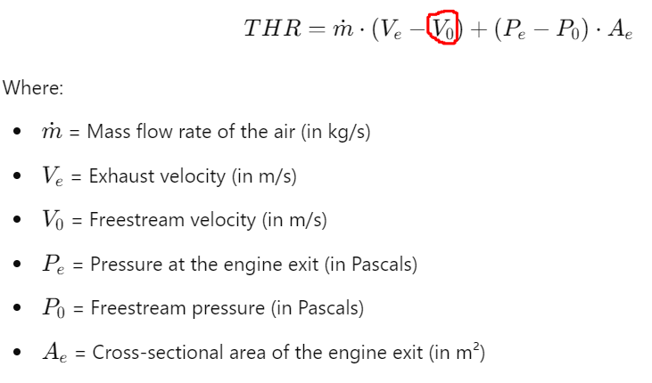
<br>

### SHP

<br>
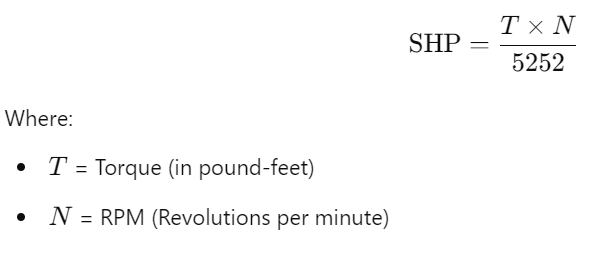
<br>

<br>
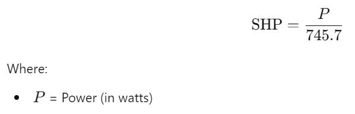
<br>

The SHP could also be calculated by a similar formula using the the engine speed in RPM instead of the velocity of the aircraft.

### Length
This feature is of little value from a design/performance perspective albeit it could be used for corelation. The part of the length between the wings and tail planes quarter chords would be of a greater interest since it dictates static and dynamic stability.

### Height
This feature is of an even smaller value than Length.

### Wing Span
Wing Span is the one single dimensional feature of real value in the dataset however even here the Wing Area would be an even more useful feature to have. Wing Span does not directly relate to Lift (via the classic Lift equation) however since the wingspan is quadratically proportional to wing area (assuming constant aspect ratio/mean chord) a correlation with Wing Span should be seen whenever there is a correlation with Wing Area.

<br>
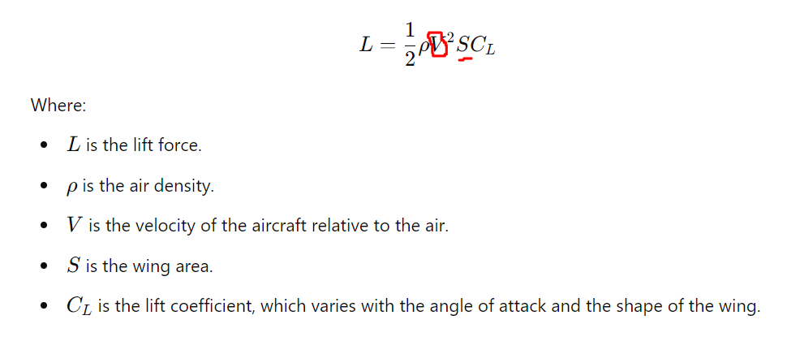
<br>

### FW (Fuel Weight)
Fuel weight (together with "AUW") naturally have strong correlation with **Range** Since the more fuel you carry in relationship to the weight of the airplane, the further you can fly (please see the equation for Range).

Note also that the FW can be used in the Range Equation.

### MEW (Empty weight, a.k.a Manufacturer's Empty Weight )
The Empty weight would be interesting to plot against **Year of first flight** and **Aircraft Structure** (see Outlook-chapter) to see if, with new modern material and buildung techniques" the airplanes have become lighter. For this such a study it is important to use MEW rather than AUW.

<br>

<br>

### AUW (Gross weight, a.k.a All-Up Weight)
The All-up Weight have a strong correlation with **Wing area** (as do MEW of course however AUW is the more appropriate feature here) since the Lifting force that the wing produces need to counteract the weight and Wing Area is part of the lift equation (see Outlook-chapter) but also Wing Span (albeit Aspect ratios vary)

Note also that the AUW can be used in the Range Equation.

<br>
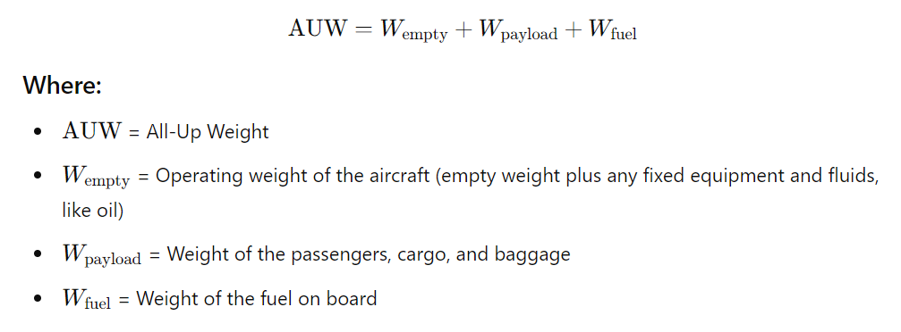
<br>

### Vmax (Max speed)
Max Speed should have a strong correlation to both Propulsion type and Multi Engine (and probably TP mods).

<br>
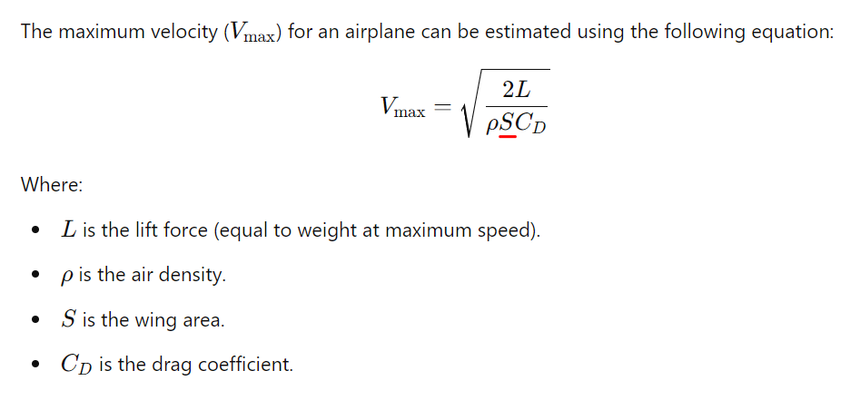
<br>

### Vcruise (Cruise speed)
Cruise Speed should have a strong correlation to both Propulsion type and Multi Engine (and probably TP mods).

<br>
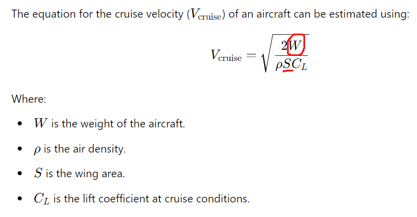
<br>

### Vstall (Stall speed)
Stall speed should have a strong correlation to AUW and the relationship with Wing Span (and even more Wing Area) and AUW
<br>
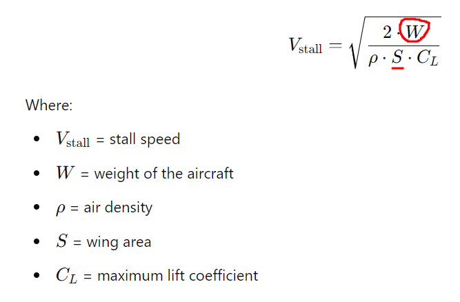
<br>

### Hmax (Max altitude)
**Velocity** is trongly correlated and Albeit not explicit in the below equation Hmax is strongly related to **ROC** since Hmax has been reached when the ROC reaches zero. Wing Span (more than Wing area) should also have a strong correlation. FW and AUW 

<br>
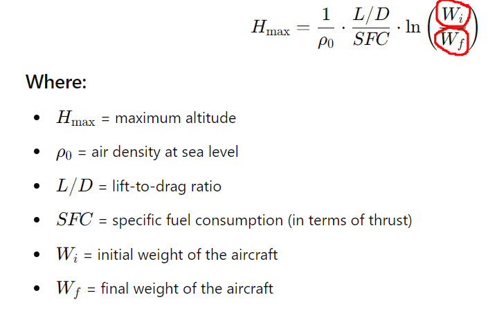
<br>

### Hmax (One) (Max altitude with only one Engine)
See Hmax.

### ROC (Rate of Climb)
THR, Vmax and AUW
<br>
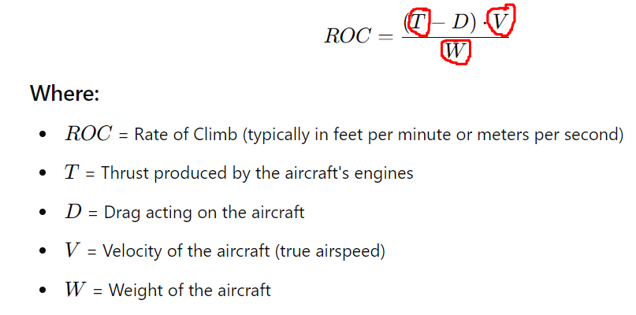
<br>

### ROC (One) (Rate of Climb with only one Engine)
See ROC.

### VLo (Climb speed during normal take-off for a 50 ft obstacle)
AUW and Span, indirectly, via Wing Area since Span and wing Area is somewhat related to each other.
<br>
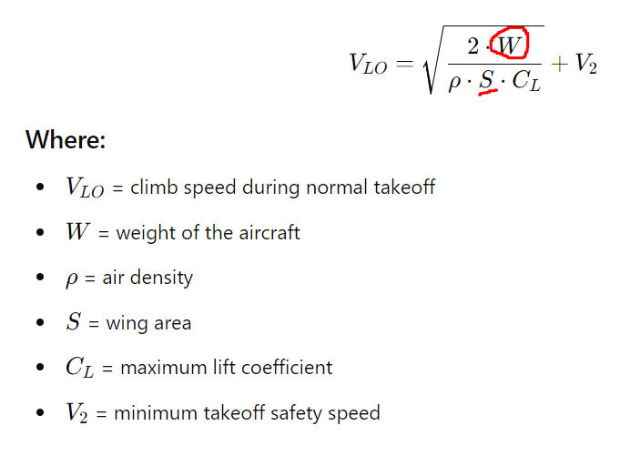
<br>

### SLo (Takeoff ground run)
The takeoff ground run has a THR and AUW
<br>
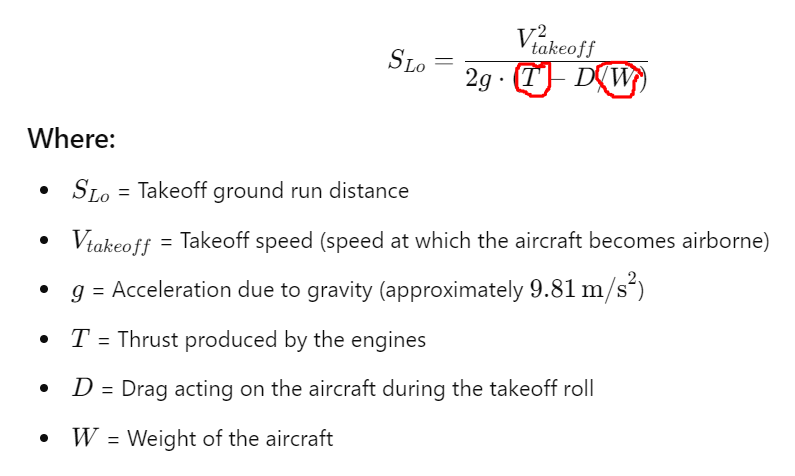
<br>

### Vl (Landing speed during normal landing for a 50 ft obstacle)
The Vl has a strong collelation to Vstall as well as the FW and AUW.
<br>
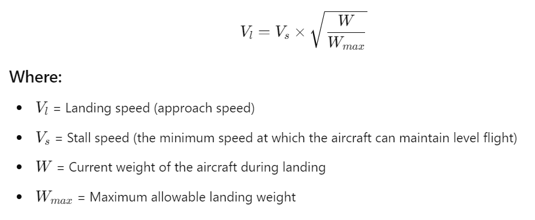
<br>

### Sl (Takeoff ground run)
Sl will only weakly correlate to the data set features. 
<br>
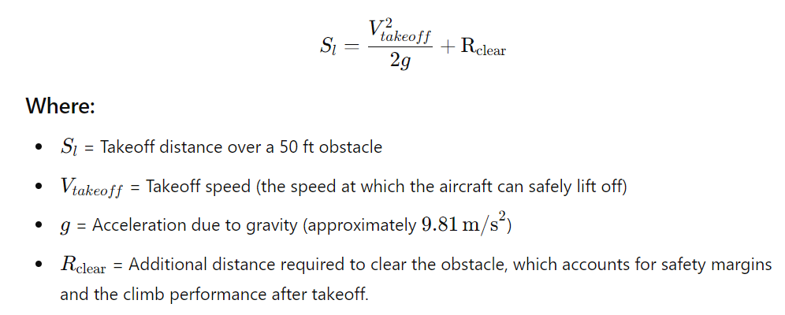
<br>

### Range
The classic Range equation (The Breguet Range equation) shows the direct relationship on the relationship between the fuel and also, indirectly, Wing Span via Lift (see the lift equation under Wing Span).

Please note that the AUW can be used as the initial weight in the Range Equation and that AUW - FW can be used as the final weight (After the fuel is consumed).

<br>
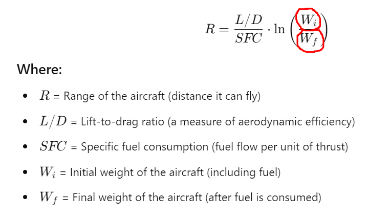
<br>
<br>

## Units of data set features
**Page Engine Type**
Note that a conversion to SI units has not been made in the data set analysis.

|      Quantity     | Meaning/Information/Quantity | Data set units (traditional Aviation units) | SI units |
|-------------------|------------------------------|---------------------------------------------|----------|
| "Propulsion size" | THR, SHP            | lbf and HP                                  | N and W  |   
| Length            | Wing Span, Lenght, Height, Slo and Sl           | ft and in                                   |    m     |  
| Distance          | Range                        | N.m. (Nautical miles)                       |   km     |  
| Weight            | FW, AUW and MEW            | lb                                          | kg or N  |
| Velocity          | Vmax, Vcruise, Vstall,          | knot or Mach and in                         |   m/s    |   
| Vertical velocity | ROC, Vlo and Vl          | ft/min                                      |   m/s    |


<br><br><br><br><br><br><br><br><br><br><br><br><br><br><br><br><br><br>


# CVD Predictor - A Predictive Classification Model for Determining Risk of Heart Disease

[CVD Predictor](https://cvd-predictor-a8ce111af1d1.herokuapp.com/) is a machine-learning (ML) project using a publically available dataset to determine whether a ML pipeline could be built in order to predict whether a patient is at risk of heart disease. This was achieved by using a classification task, using the HeartDisease attribute from the dataset as the target and the remaining attributes as features.

## Table of Contents

- [Dataset Content](#dataset-content)
- [Business Requirements](#business-requirements)
- [Hypothesis](#hypothesis-and-how-to-validate)
- [Mapping Business Requirements to Data Visualisation and ML Tasks](#the-rationale-to-map-the-business-requirements-to-the-data-visualizations-and-ml-tasks)
- [ML Business Case](#ml-business-case)
- [Epics and User Stories](#epics-and-user-stories)
- [Dashboard Design](#dashboard-design)
- [Technologies Used](#technologies-used)
- [Testing](#testing)
- [Unfixed Bugs](#unfixed-bugs)
- [Deployment](#deployment)
- [Credits](#credits)
- [Acknowledgements](#acknowledgements)


## Dataset Content

* The dataset is sourced from [Kaggle](https://www.kaggle.com/datasets/fedesoriano/heart-failure-prediction/data). Each row represents a patient and each column contains a patient attribute. The dataset includes information about:
    - patient age and sex
    - patient medical information such as blood pressure, heart rate and cholesterol levels
    - whether or not the patient had heart disease

| Attribute      | Information                               | Units                                                                                       |
|----------------|-------------------------------------------|---------------------------------------------------------------------------------------------|
| Age            | age of the patient                        | years                                                                                       |
| Sex            | sex of the patient                        | M: Male, F: Female                                                                          |
| ChestPainType  | chest pain type                           | TA: Typical Angina, ATA: Atypical Angina, NAP: Non-Anginal Pain, ASY: Asymptomatic          |
| RestingBP      | resting blood pressure                    | mm Hg                                                                                       |
| Cholesterol    | serum cholesterol                         | mm/dl                                                                                       |
| FastingBS      | fasting blood sugar                       | 1: if FastingBS > 120 mg/dl, 0: otherwise                                                   |
| RestingECG     | resting electrocardiogram results         | Normal: Normal, ST: having ST-T wave abnormality (T wave inversions and/or ST elevation or depression of > 0.05 mV), LVH: showing probable or definite left ventricular hypertrophy by Estes' criteria |
| MaxHR          | maximum heart rate achieved               | Numeric value between 60 and 202                                                            |
| ExerciseAngina | exercise-induced angina                   | Y: Yes, N: No                                                                               |
| Oldpeak        | oldpeak = ST depression induced by exercise relative to rest | Numeric value measured in depression                                     |
| ST_Slope       | the slope of the peak exercise ST segment | Up: upsloping, Flat: flat, Down: downsloping                                                |
| HeartDisease   | output class                              | 1: heart disease, 0: Normal                                                                 |

[Back to top](#table-of-contents)

## Business Requirements
* Cardiovascular diseases are the number 1 cause of death globally, accounting for 31% of all deaths worldwide. People with cardiovascular disease or who are at high risk of disease need early detection and management. A fictional organisation has requested a data practitioner to analyse a dataset of patients from a number of different hospitals in order to determine what factors can be attributed to a high risk of disease and whether patient data can accurately predict risk of heart disease.

* Business Requirement 1 - The client is interested in which attributes correlate most closely with heart disease, ie what are the most common risk factors?
* Business Requirement 2 - The client is interested in using patient data to predict whether or not a patient is at risk of heart disease.

[Back to top](#table-of-contents)

## Hypothesis and how to validate?
* Hypothesis 1:
    - We suspect that the highest risk factors involved in heart disease are cholesterol and maximum heart rate.
    - **Validation**: a correlation analysis that indicates a strong relationship between the above features and the target 'HeartDisease'.

* Hypothesis 2:
    - We suspect that a successful prediction will rely on a large number of parameters.
    - **Validation**: analysis of the feature importance from the ML pipeline after hyperparameter optimisation will indicate at least 5/11 of the features are necessary for a prediction.

* Hypothesis 3:
    - We suspect that men over 50 with high cholesterol are the most at-risk patient group.
    - **Validation**: analysis and visualisation using a parallel plot of the dataset to determine a 'typical' heart disease patient profile

[Back to top](#table-of-contents)

## The rationale to map the business requirements to the Data Visualizations and ML tasks
* **Business Requirement 1**: Data Visualisation and Correlation study
    - We need to perform a correlation study to determine which features correlate most closely to the target.
    - A Pearson's correlation will indicate linear relationships between numerical variables.
    - A Spearman's correlation will measure the monotonic relationships between variables.
    - A Predictive Power Score study can also be used to determine relationships between attributes regardless of data type (6/11 features are categorical).
    - This will be carried out during the **Data Visualization, Cleaning, and Preparation** Epic (see Epics & User Stories).

* **Business Requirement 2**: Classification Model
    - We need to predict whether a patient is at risk of heart disease or not.
    - Therefore we need to build a binary classification model.
    - A conventional machine learning pipeline will be able to map the relationships between the features and target.
    - Extensive hyperparameter optimisation will give us the best chance at a highly accurate prediction.
    - This will be carried out during the **Model Training, Optimization and Validation** Epic (see Epics & User Stories).

[Back to top](#table-of-contents)

## ML Business Case
**Classification Model**
* We want a ML model to predict whether a patient is at risk of heart disease based upon previously gathered patient data. The target variable, 'HeartDisease', is categorical and contains two classes: 0 (no heart disease) and 1 (heart disease).
* We will consider a **classification model**, a supervised model with a two-class, single-label output that matches the target.
* The model success metrics are:
    - at least 75% recall for heart disease on the train and test sets
* The model will be considered a failure if:
    - the model fails to achieve 75% recall for heart disease
    - the model fails to achieve 70% precision for no heart disease (falsely indicating patients are at risk)
* The model output is defined as a flag, indicating if a patient will have heart disease or not and the associated probability of heart disease.
* The training data to fit the model comes from: [Kaggle](https://www.kaggle.com/datasets/fedesoriano/heart-failure-prediction/data)
    - The dataset contains: 918 observations and 12 attributes.
    - Target: HeartDisease; Features: all other attributes.

[Back to top](#table-of-contents)

## Epics and User Stories
* The project was split into 5 Epics based upon the Data Visualisation and Machine Learning tasks and within each of these, user stories were set out to enable an agile methodology.

### Epic - Information Gathering and Data Collection
* **User Story** - As a data analyst, I can import the dataset from Kaggle so that I can save the data in a local directory.
* **User Story** - As a data analyst, I can load a saved dataset so that I can analyse the data to gain insights on what further tasks may be required.

### Epic - Data Visualization, Cleaning, and Preparation
* **User Story** - As a data scientist, I can visualise the dataset so that I can interpret which attributes correlate most closely with heart disease (**Business Requirement 1**).
* **User Story** - As a data analyst, I can evaluate the dataset to determine what data cleaning tasks need to be carried out.
* **User Story** - As a data analyst, I can impute or drop missing data to prepare the dataset for a ML model.
* **User Story** - As a data analyst, I can determine whether the target requires balancing in order to ensure the ML is not fed imbalanced data.
* **User Story** - As a data scientist, I can carry out feature engineering to best transform the data for the ML model.

### Epic - Model Training, Optimization and Validation
* **User Story** - As a data scientist, I can split the data into a train and test set to prepare it for the ML model.
* **User Story** - As a data engineer, I can fit a ML pipeline with all the data to prepare the ML model for deployment.
* **User Story** - As a data engineer, I can determine the best algorithm for predicting heart disease to use in the ML model (**Business Requirement 2**).
* **User Story** - As a data engineer, I can carry out an extensive hyperparameter optimisation to ensure the ML model gives the best results (**Business Requirement 2**).
* **User Story** - As a data scientist, I can determine the best features from the ML pipeline to determine whether the ML model can be optimised further (**Business Requirement 2**).
* **User Story** - As a data scientist, I can evaluate the ML model's performance to determine whether it can successfully predict heart disease (**Business Requirement 2**).

### Epic - Dashboard Planning, Designing, and Development
* **User Story** - As a non-technical user, I can view a project summary that describes the project, dataset and business requirements to understand the project at a glance.
* **User Story** - As a non-technical user, I can view the project hypotheses and validations to determine what the project was trying to achieve and whether it was successful.
* **User Story** - As a non-technical user, I can enter unseen data into the model and receive a prediction (**Business Requirement 2**).
* **User Story** - As a technical user, I can view the correlation analysis to see how the outcomes were reached (**Business Requirement 1**).
* **User Story** - As a technical user, I can view all the data to understand the model performance and see statistics related to the model (**Business Requirement 2**).
* **User Story** - As a non-technical user, I can view the project conclusions to see whether the model was successful and if the business requirements were met.

### Epic - Dashboard Deployment and Release
* **User Story** - As a user, I can view the project dashboard on a live deployed website.
* **User Story** - As a technical user, I can follow instructions in the readme to fork the repository and deploy the project for myself.

[Back to top](#table-of-contents)

## Dashboard Design
### Page 1: Project Summary
* **Section 1 - Summary**
    * Introduction to project
    * Description of dataset, where was it sourced?
    * Link to readme
* **Section 2 - Business Requirements**
    * Description of business requirements

### Page 2: Project Hypotheses
* Outline the three project hypothesis
* Present validation of each hypothesis

### Page 3: Feature Correlation Study
* State business requirement 1
* Overview of dataset - display first 5 rows of data and describe dataset shape
* Display correlation results and PPS heatmap
* Display distributions of correlated features against target
* Conclusions

### Page 4: Heart Disease Prediction
* State business requirement 2
* Widget inputs for prediction
* "Run prediction" button to run inputted data through the ML model and output a prediction and % chance

### Page 5: Classification Performance Metrics
* Summary of model performance and metrics
* Model pipeline, features used to train the model and how they were selected
* Documentation of model performance on train and test sets

[Back to top](#table-of-contents)

## Technologies Used

The technologies used throughout the development are listed below:

### Languages

* [Python](https://www.python.org/)

### Python Packages

* [Pandas](https://pandas.pydata.org/docs/index.html) - Open source library for data manipulation and analysis.
* [Numpy](https://numpy.org/doc/stable/index.html) - Adds support for large, multi-dimensional arrays and matrices, and high-level mathematical functions.
* [YData Profiling](https://docs.profiling.ydata.ai/latest/) - For data profiling and exploratory data analysis.
* [Matplotlib](https://matplotlib.org/) - Comprehensive library for creating static, animated and interactive visualisations.
* [Seaborn](https://seaborn.pydata.org/) - Another data visualisation library for drawing attractive and informative statistical graphics.
* [Pingouin](https://pingouin-stats.org/build/html/index.html) - Open source statistical package for simple yet exhaustive stats functions.
* [Feature-engine](https://feature-engine.trainindata.com/en/latest/) - Library with multiple transformers to engineer and select features for machine learning models.
* [ppscore](https://pypi.org/project/ppscore/) - Library for detecting linear or non-linear relationships between two features.
* [scikit-learn](https://scikit-learn.org/stable/) - Open source machine learning library that features various algorithms for training a ML model.
* [SciPy](https://scipy.org/) - Library used for scientific computing and technical computing.
* [XGBoost](https://xgboost.readthedocs.io/en/stable/) - Optimised distributed gradient boosting library.
* [Imbalanced-learn](https://imbalanced-learn.org/stable/) - Provides tools for dealing with classification problems with imbalanced classes.
* [Joblib](https://joblib.readthedocs.io/en/stable/) - Provides tools for lightweight pipelining, e.g. caching output values.

### Other Technologies

* [Git](https://git-scm.com/) - For version control
* [GitHub](https://github.com/) - Code repository and GitHub projects was used as a Kanban board for Agile development
* [Heroku](https://heroku.com) - For application deployment
* [VSCode](https://code.visualstudio.com/) - IDE used for development

[Back to top](#table-of-contents)

## Testing
### Manual Testing

#### User Story Testing
* Dashboard was manually tested using user stories as a basis for determining success.
* Jupyter notebooks were reliant on consecutive functions being successful so manual testing against user stories was deemed irrelevant.

*As a non-technical user, I can view a project summary that describes the project, dataset and business requirements to understand the project at a glance.*

| Feature | Action | Expected Result | Actual Result |
| --- | --- | --- | --- |
| Project summary page | Viewing summary page | Page is displayed, can move between sections on page | Functions as intended |

---

*As a non-technical user, I can view the project hypotheses and validations to determine what the project was trying to achieve and whether it was successful.*

| Feature | Action | Expected Result | Actual Result |
| --- | --- | --- | --- |
| Project hypotheses page | Navigate to page | Clicking on navbar link in sidebar navigates to correct page | Functions as intended |

---

*As a non-technical user, I can enter unseen data into the model and receive a prediction (Business Requirement 2).*

| Feature | Action | Expected Result | Actual Result |
| --- | --- | --- | --- |
| Prediction page | Navigate to page | Clicking on navbar link in sidebar navigates to correct page | Functions as intended |
| Enter live data | Interact with widgets | All widgets are interactive, respond to user input | Functions as intended |
| Live prediction | Click on 'Run Predictive Analysis' button | Clicking on button displays message on page with prediction and % chance | Functions as intended |

---

*As a technical user, I can view the correlation analysis to see how the outcomes were reached (Business Requirement 1).*

| Feature | Action | Expected Result | Actual Result |
| --- | --- | --- | --- |
| Correlation Study page | Navigate to page | Clicking on navbar link in sidebar navigates to correct page | Functions as intended |
| Correlation data | Tick correlation results checkbox | Correlation data is displayed on dashboard | Functions as intended |
| PPS Heatmap | Tick PPS heatmap checkbox | Heatmap is displayed on dashboard | Functions as intended |
| Feature Correlation | Select feature from dropdown box | Relevant countplot is displayed | Functions as intended |
| Parallel Plot | Tick parallel plot checkbox | Parallel plot is displayed on dashboard, is interactive | Functions as intended |

---

*As a technical user, I can view all the data to understand the model performance and see statistics related to the model (Business Requirement 2)*

| Feature | Action | Expected Result | Actual Result |
| --- | --- | --- | --- |
| Model performance page | Navigate to page | Clicking on navbar link in sidebar navigates to correct page | Functions as intended |
| Success metrics | View page | Success metrics outlined in business case are displayed | Functions as intended |
| ML Pipelines | View page | Both ML Pipelines from Jupyter notebooks are displayed | Functions as intended |
| Feature Importance | View page | Most important features are plotted and displayed | Functions as intended |
| Model Performance | View page | Confusion matrix for train and test sets are displayed | Functions as intended |

---

### Validation
All code in the app_pages and src directories was validated as conforming to PEP8 standards using CodeInstitute's PEP8 Linter.
* Some files had warnings due to 'line too long', however these were related to long strings when writing to the dashboard.
* These warnings were ignored as it did not effect the readability of any functions.

### Automated Unit Tests
No automated unit tests have been carried out at this time.

[Back to top](#table-of-contents)

## Issues
### Heroku Slug Size and XGBoost
* Development of the classification model initially took place using XGBoost version 2.0.3 (see outputs/ml_pipeline/classification_model/v1).
* The model gave excellent results with 93% recall for heart disease on both train and test sets, and precision on no heart disease of 90% for the train set and 85% for the test set.
* Unfortunately, upon deployment of the dashboard on Heroku using this model failed as the slug size was too large.


* A number of attempts were made to reduce the slug size, including adding all unnecessary files for deployment to the ```.slugignore``` file, removing requirements from ```requirements.txt``` so that only packages necessary for deployment were present and purging the build cache using the Heroku CLI.
* These attempts were unsuccessful, and the slug size remained too large.
* During further analysis of the build log, I noticed that the size of XGBoost was very large:


* Therefore, I attempted to roll back to an older version of XGBoost (version 1.7.6) in order to reduce it's size.
* This was successful, and the app was now able to be deployed to Heroku, however my model no longer gave the same performance.
* I carried out hyperparameter optimisation again, resulting in v2 of the model, however the performance was still not as good as achieved in v1.
* I had to accept this trade-off in performance, due to the limitations of Heroku deployment.

[Back to top](#table-of-contents)

## Unfixed Bugs
* At the time of writing, there are no unfixed bugs within the project.

[Back to top](#table-of-contents)

## Deployment
### Heroku

* The App live link is: [CVD Predictor](https://cvd-predictor-a8ce111af1d1.herokuapp.com/)

The project was deployed to Heroku using the following steps:

1. Within your working directory, ensure there is a setup.sh file containing the following:
```
mkdir -p ~/.streamlit/
echo "\
[server]\n\
headless = true\n\
port = $PORT\n\
enableCORS = false\n\
\n\
" > ~/.streamlit/config.toml
```
2. Within your working directory, ensure there is a runtime.txt file containing a [Heroku-20](https://devcenter.heroku.com/articles/python-support#supported-runtimes) stack supported version of Python.
```
python-3.10.12
```
3. Within your working directory, ensure there is a Procfile file containing the following:
```
web: sh setup.sh && streamlit run app.py
```
4. Ensure your requirements.txt file contains all the packages necessary to run the streamlit dashboard.
5. Update your .gitignore and .slugignore files with any files/directories that you do not want uploading to GitHub or are unnecessary for deployment.
6. Log in to [Heroku](https://id.heroku.com/login) or create an account if you do not already have one.
7. Click the **New** button on the dashboard and from the dropdown menu select "Create new app".
8. Enter a suitable app name and select your region, then click the **Create app** button.
9. Once the app has been created, navigate to the Deploy tab.
10. At the Deploy tab, in the Deployment method section select **GitHub**.
11. Enter your repository name and click **Search**. Once it is found, click **Connect**.
12. Navigate to the bottom of the Deploy page to the Manual deploy section and select main from the branch dropdown menu.
13. Click the **Deploy Branch** button to begin deployment.
14. The deployment process should happen smoothly if all deployment files are fully functional. Click the button **Open App** at the top of the page to access your App.
15. If the build fails, check the build log carefully to troubleshoot what went wrong.

[Back to top](#table-of-contents)

## Forking and Cloning
If you wish to fork or clone this repository, please follow the instructions below:

### Forking
1. In the top right of the main repository page, click the **Fork** button.
2. Under **Owner**, select the desired owner from the dropdown menu.
3. **OPTIONAL:** Change the default name of the repository in order to distinguish it.
4. **OPTIONAL:** In the **Description** field, enter a description for the forked repository.
5. Ensure the 'Copy the main branch only' checkbox is selected.
6. Click the **Create fork** button.

### Cloning
1. On the main repository page, click the **Code** button.
2. Copy the HTTPS URL from the resulting dropdown menu.
3. In your IDE terminal, navigate to the directory you want the cloned repository to be created.
4. In your IDE terminal, type ```git clone``` and paste the copied URL.
5. Hit Enter to create the cloned repository.

### Installing Requirements
**WARNING:** The packages listed in the requirements.txt file are limited to those necessary for the deployment of the dashboard to Heroku, due to the limit on the slug size.

In order to ensure all the correct dependencies are installed in your local environment, run the following command in the terminal:

    pip install -r full-requirements.txt

[Back to top](#table-of-contents)

## Credits 

### Content 

#### Exploratory Data Analysis Notebook
* The code for the histogram/QQ plots were taken from the Code Institute "Churnometer" walkthrough project.
* The code for the PPS heatmap function was taken from the Code Institute "Exploratory Data Analysis Tools" module.

#### Data Cleaning Notebook
* The custom function for checking the effect of data cleaning on distribution was taken from the Code Institute "Data Analytics Packages - ML: feature-engine" module.

#### Feature Engineering Workbook
* The custom function for analysing transformations during feature engineering was taken from the Code Institute "Data Analytics Packages - ML: feature-engine" module.

#### Modelling And Evaluation Notebook
* Abhishek Thakur's ["Approaching (Almost) Any Machine Learning Problem"](https://www.linkedin.com/pulse/approaching-almost-any-machine-learning-problem-abhishek-thakur/) post on LinkedIn and Jason Brownlee's [Machine Learning Mastery](https://machinelearningmastery.com/hyperparameters-for-classification-machine-learning-algorithms/) website were both used to help define the hyperparameter values used for optimisation.
* The custom function for carrying out hyperparameter optimisation was taken from the Code Institute "Data Analytics Packages - ML: Scikit-learn" module.
* The custom function for displaying the confusion matrix and analysing model performance was taken from the Code Institute "Data Analytics Packages - ML: Scikit-learn" module.

#### Streamlit Dashboard
* The multi-page class was taken from the Code Institute "Data Analysis & Machine Learning Toolkit" streamlit lessons.

[Back to top](#table-of-contents)

## Acknowledgements
* Thanks to my mentor Mo Shami, for his support and guidance on the execution of the project

[Back to top](#table-of-contents)
